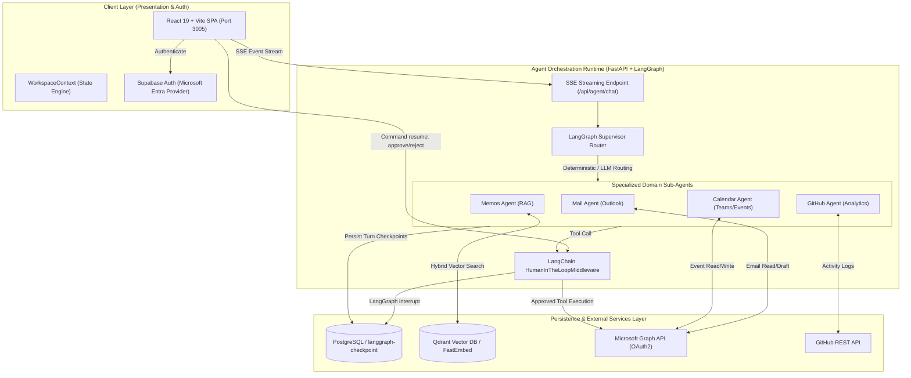

<div align="center">

# Friday (Dora)
### Self-Hostable Personal AI Workspace & Multi-Agent Copilot

  <p align="center">
    An open-source, bilingual (zh/en) personal workspace integrating <b>Outlook Mail</b>, <b>Calendar</b>, <b>Qdrant-powered RAG Memos</b>, and <b>GitHub Work Analytics</b> through an explicit multi-agent orchestration architecture. Currently in active alpha.
  </p>

  <p align="center">
    <a href="https://github.com/hunanjay/friday/actions/workflows/ci.yml"></a>
    <a href="https://github.com/hunanjay/friday/issues"></a>
    <a href="https://fastapi.tiangolo.com/"></a>
    <a href="https://langchain-ai.github.io/langgraph/"></a>
    <a href="https://react.dev/"></a>
    <a href="https://qdrant.tech/"></a>
    <a href="./LICENSE"></a>
  </p>

  <p align="center">
    <a href="./DEPLOY.md">📦 部署指南</a>
    &nbsp;·&nbsp;
    <a href="./CONTRIBUTING.md">🤝 贡献规范</a>
    &nbsp;·&nbsp;
    <a href="./SECURITY.md">🛡️ 安全策略</a>
    &nbsp;·&nbsp;
    <a href="./TODO.md">🛣️ Roadmap</a>
    &nbsp;·&nbsp;
    <a href="https://github.com/hunanjay/friday/issues">🐛 报告 Bug</a>
  </p>

</div>

---

## 📖 Overview

**Friday** (branded in UI as **Dora**) is an open-source, self-hostable personal productivity workspace in active alpha. Built on **FastAPI**, a **LangGraph multi-agent supervisor pattern**, and **React 19**, it connects Microsoft Graph and GitHub with personal knowledge management through Qdrant RAG. Its agent layer applies explicit routing and bounded, domain-specific context instead of sharing an unbounded cross-domain conversation history.

> **Project status: Alpha.** APIs, database schemas, and deployment details may change. Use a test Microsoft tenant/account when evaluating the project, and review its integration permissions before using sensitive data.

Design goals include **explicit control-flow scoping**, **deterministic agent routing**, **reusable write approval**, and **stateful multi-agent turn persistence**.

---

## 🏗️ System Architecture

The workspace separates client-side presentation, agent orchestration, and persistent storage integrations.



---

## ⚙️ Core Technical Capabilities

### 1. Multi-Agent Supervisor & Deterministic Routing Pipeline
- **Orchestration**: Implements `langgraph-supervisor` to coordinate four isolated domain-specific sub-agents (`mail_agent`, `calendar_agent`, `memos_agent`, `github_agent`).
- **Routing Policy**: A single explicit policy applies slash-command routing first, deterministic email-send routing second, then falls back to the supervisor. This keeps the public entry paths consistent while preserving shared state checkpoints.
- **Context Management**: Conversation turns are persisted in PostgreSQL via `langgraph-checkpoint-postgres`. The supervisor receives a 20k-token trimmed history; each domain agent receives a 10k-token scoped task brief, its current tool-call chain, and only relevant same-domain prior turns.

### 2. LangChain Human-in-the-Loop (HITL)
For policy-controlled agent write operations:
- Domain agents use LangChain's official `HumanInTheLoopMiddleware` with `interrupt_on` policies for email and calendar mutations.
- The middleware pauses the actual tool call before execution and persists the interrupt in the existing PostgreSQL LangGraph checkpoint.
- The frontend renders the interrupt through a trusted local preview adapter. Decisions invoke `/api/agent/actions/{id}/decisions/{decision}`, which resumes the same graph thread with `Command(resume=...)`.
- Only an approved resume reaches the original tool implementation. Rejection produces a tool error result and the write is skipped.
- Resolved card snapshots are stored in a presentation-only audit table so confirmed cards survive refreshes; this table never authorizes or executes a tool.

Lower-risk local writes such as memo creation remain outside the mandatory gate by policy. Direct user actions in first-party pages are also separate from model-triggered approvals.

### 3. Hybrid RAG Knowledge Engine
- **Vector Infrastructure**: Powered by **Qdrant** combined with **FastEmbed** ONNX embeddings.
- **Hybrid Retrieval**: Merges dense semantic vector similarity with BM25 keyword matching for high-precision personal memo retrieval.

### 4. OAuth Identity & Token Lifecycle
- **Identity Provider**: Supabase Auth coupled with Microsoft Entra (Azure AD) OAuth2.
- **Silent Refresh Protocol**: Server-side token store (`token_store.py`) handles token refresh cycles out-of-band via `httpx` async connection pools, maintaining un-interrupted Graph API access without client-side credential exposure.

---

## 📂 Project Structure

```
friday/
├── backend/                        # FastAPI & LangGraph Backend Service
│   ├── app/
│   │   ├── agents/                 # Multi-agent graph & tool definitions
│   │   │   ├── hitl.py             # Official HITL policy & UI adapter
│   │   │   ├── supervisor.py       # Single-entry LangGraph supervisor router
│   │   │   └── tools.py            # Agent tool schemas
│   │   ├── api/                    # REST & SSE API endpoints
│   │   │   ├── agent.py            # Chat streaming & action confirmation
│   │   │   └── auth.py             # Microsoft Graph token exchange
│   │   ├── infrastructure/         # External integrations & Persistence
│   │   │   ├── db/                 # Postgres connection pools & token stores
│   │   │   ├── graph/client.py     # Microsoft Graph Async HTTP client
│   │   │   └── vector_store.py     # Qdrant RAG client
│   │   └── main.py                 # Application lifecycle & middleware
│   ├── requirements.txt            # Python dependencies
│   └── Dockerfile
├── frontend/                       # React 19 Frontend SPA
│   ├── src/
│   │   ├── components/             # Reusable UI components & Action Widgets
│   │   ├── context/                # Global WorkspaceContext & ThemeContext
│   │   ├── i18n/                   # react-i18next locale files (zh/en)
│   │   ├── pages/                  # Page routes (Email, Calendar, Chat, Memos)
│   │   └── router/                 # React Router configuration
│   └── vite.config.js              # Vite build configuration
├── supabase/                       # Supabase configuration & migrations
├── TODO.md                         # Product Roadmap & Technical Backlog
└── README.md
```

---

## ⚡ Quick Start

### Prerequisites
- **Python**: `3.11` or higher
- **Node.js**: `v18.0` or higher
- **PostgreSQL**: `v14+` with binary psycopg pool support
- **Qdrant**: Local vector engine or Qdrant Cloud cluster

### 1. Environment Configuration

Copy environment template files in both `backend` and `frontend` directories:

```bash
# Backend Environment Setup
cp backend/.env.example backend/.env

# Frontend Environment Setup
cp frontend/.env.example frontend/.env
```

Key environment variables to populate in `backend/.env`:
- `OPENAI_API_KEY` & `OPENAI_BASE_URL`
- `EMBEDDING_MODEL` & `EMBEDDING_DIMENSIONS` (for 智谱 use `embedding-3` and `1536`)
- `AZURE_CLIENT_ID` & `AZURE_CLIENT_SECRET`
- `SUPABASE_URL` & `SUPABASE_SERVICE_ROLE_KEY`
- `CHECKPOINT_DB_URL`
- `QDRANT_URL` & `QDRANT_API_KEY`

### 2. Backend Installation & Execution

```bash
cd backend

# Create & activate virtual environment
python -m venv .venv
source .venv/bin/activate   # On Windows: .venv\Scripts\activate

# Install dependencies
pip install -r requirements.txt

# Run development server (Port 8005)
uvicorn app.main:app --reload --port 8005
```

*For Agent Graph debugging, execute `langgraph dev` within `backend/` to open LangGraph Studio.*

### 3. Frontend Installation & Execution

```bash
cd frontend

# Install Node modules
npm install

# Start Vite dev server (Port 3005)
npm run dev
```

Navigate to `http://localhost:3005` in your browser.

---

### Quality Checks

```bash
# Backend smoke tests
cd backend
.venv/bin/python tests/test_smoke.py

# Frontend lint, tests, and production build
cd frontend
npm run lint
npm test
npm run build
```

GitHub Actions runs these checks for every push and pull request.

---

## 🛣️ Development Roadmap

Refer to [TODO.md](./TODO.md) or [GitHub Issue #1](https://github.com/hunanjay/friday/issues/1) for full feature specifications.

- [x] **Core Orchestration**: LangGraph Supervisor + Checkpoint Persistence
- [x] **Integrations**: Microsoft Graph API (Mail/Calendar) & GitHub REST API
- [x] **RAG Subsystem**: Qdrant + FastEmbed Hybrid Search
- [x] **HITL Gate**: LangChain HumanInTheLoopMiddleware + durable LangGraph interrupts
- [ ] 🚧 **[In Development] Invoice & Expense Automation**: Multimodal invoice OCR, auto-duplication checks, and expense report generation.
- [ ] 📅 **Proactive Autonomous Briefings**: Scheduled daily morning/evening summaries.
- [ ] 🔍 **Universal RAG Indexing**: Cross-domain semantic search spanning Emails, Calendar, and Memos.

---

## 🔒 Security & Privacy Architecture

- **Token Safety**: Microsoft OAuth Refresh Tokens are stored exclusively server-side in PostgreSQL with encryption at rest and are never returned to the client DOM.
- **Input Sanitization**: Email HTML body content is sanitized via an internal `html_sanitizer` module to prevent prompt injection and XSS vectors.
- **State Machine Atomicity**: Pending destructive actions use database-level transactional locks to eliminate race conditions and dual-execution exploits.

---

## 📜 License

This project is licensed under the **MIT License** — see the [LICENSE](./LICENSE) file for details.

Copyright (c) 2026 Logan Jian (hunanjay)
